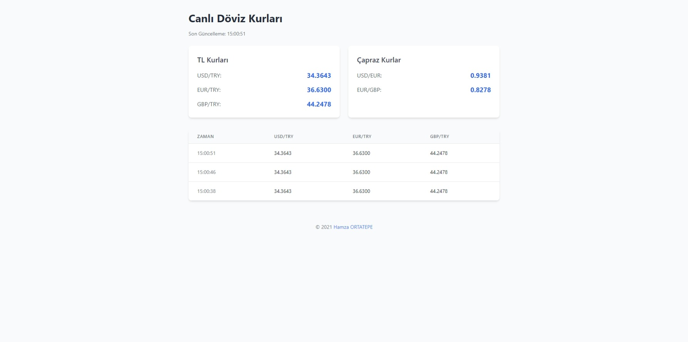

# Canlı Döviz Kuru Takip Uygulaması | Live Currency Tracker Application


## 🇹🇷 Türkçe

Bu uygulama, canlı döviz kurlarını takip etmenizi sağlayan bir web ve masaüstü uygulamasıdır. USD, EUR, GBP ve daha fazla para biriminin kurlarını TL bazında ve çapraz kurları gerçek zamanlı olarak gösterir, grafik analizi ve alarmlama özellikleri sunar.

### Teknolojiler

- Backend:
  - Python 3.x
  - WebSockets (websockets)
  - aiohttp
  - asyncio
- Frontend/Web Sürümü:
  - HTML5
  - JavaScript
  - Tailwind CSS
  - Chart.js
- Masaüstü Sürümü:
  - PyQt5
  - Matplotlib

### Gereksinimler

```bash
pip install -r requirements.txt
```

### Kurulum
1. Repoyu klonlayın.
```bash
git clone https://github.com/hamer1818/socket-doviz.git
```
2. Klasöre girin.
```bash
cd socket-doviz
```
3. Gerekli kütüphaneleri yükleyin.
```bash
pip install -r requirements.txt
```
4. Web uygulamasını çalıştırın:
```bash
python main.py
```
5. `index.htm` dosyasını tarayıcınızda açın.

### Masaüstü Uygulaması
Masaüstü arayüzünü başlatmak için:
```bash
python main_gui.py
```

### Özellikler
- Gerçek zamanlı döviz kurları
- USD, EUR, GBP, JPY, CHF, CAD, AUD kurları
- Çapraz kurlar (USD/EUR, EUR/GBP)
- Döviz kuru grafikleri
- Döviz hesaplayıcı
- Fiyat alarmları
- Trend analizi ve değişim yüzdeleri
- Geçmiş veriler tablosu
- Web ve masaüstü versiyonları

### API
Uygulama, [ExchangeRate API](https://api.exchangerate-api.com) kullanarak döviz kurlarını alır.

### Ekran Görüntüleri


## 🇬🇧 English

This application is a web and desktop application that allows you to track live exchange rates. It displays the rates of USD, EUR, GBP, and more currencies against TRY in real-time, as well as cross rates, and offers chart analysis and alert features.

### Technologies

- Backend:
  - Python 3.x
  - WebSockets (websockets)
  - aiohttp
  - asyncio
- Frontend/Web Version:
  - HTML5
  - JavaScript
  - Tailwind CSS
  - Chart.js
- Desktop Version:
  - PyQt5
  - Matplotlib

### Requirements

```bash
pip install -r requirements.txt
```

### Installation
1. Clone the repository.
```bash
git clone https://github.com/hamer1818/socket-doviz.git
```
2. Navigate to the directory.
```bash
cd socket-doviz
```
3. Install the required libraries.
```bash
pip install -r requirements.txt
```
4. Run the web application:
```bash
python main.py
```
5. Open `index.htm` in your browser.

### Desktop Application
To start the desktop interface:
```bash
python main_gui.py
```

### Features
- Real-time exchange rates
- USD, EUR, GBP, JPY, CHF, CAD, AUD rates
- Cross rates (USD/EUR, EUR/GBP)
- Currency rate charts
- Currency converter
- Price alerts
- Trend analysis and change percentages
- Historical data table
- Web and desktop versions

### API
The application uses the [ExchangeRate API](https://api.exchangerate-api.com) to retrieve currency rates.

### Screenshots


## Lisans | License
Bu proje MIT lisansı ile lisanslanmıştır. Daha fazla bilgi için [LICENSE](LICENSE) dosyasına bakabilirsiniz.

This project is licensed under the MIT License. For more information, please see the [LICENSE](LICENSE) file.