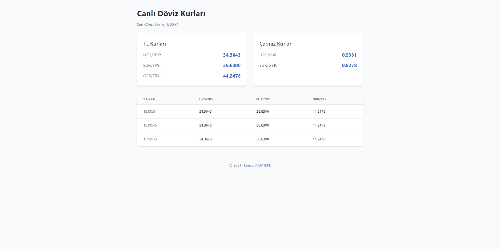

# Canlı Döviz Kuru Takip Uygulaması


Bu uygulama, canlı döviz kurlarını takip etmenizi sağlayan bir web uygulamasıdır. USD, EUR ve GBP kurlarını TL bazında ve çapraz kurları gerçek zamanlı olarak gösterir.

## Teknolojiler

- Backend:
  - Python 3.x
  - WebSockets (websockets)
  - aiohttp
  - asyncio
- Frontend:
  - HTML5
  - JavaScript
  - Tailwind CSS

## Gereksinimler

```bash
pip install websockets aiohttp
```
## Kurulum
1. Repoyu klonlayın.
```bash
git clone https://github.com/hamer1818/socket-doviz.git
```
2. Klasöre girin.
```bash
cd socket-doviz
```
3. Gerekli kütüphaneleri yükleyin.
```bash
pip install -r requirements.txt
```
4. Uygulamayı çalıştırın.
```bash
python main.py
```
5. `index.html` dosyasını tarayıcınızda açın.

## Özellikler
- Gerçek zamanlı döviz kurları
- USD, EUR ve GBP kurları
- Çapraz kurlar
- Otomatik güncelleme
- Anlık fiyat değişimleri

## API
Uygulama, [Döviz Kuru API](https://exchangeratesapi.io/) kullanarak döviz kurlarını alır. API, her saat başı güncellenir.

## Ekran Görüntüleri


## Lisans
Bu proje MIT lisansı ile lisanslanmıştır. Daha fazla bilgi için [LICENSE](LICENSE) dosyasına bakabilirsiniz.